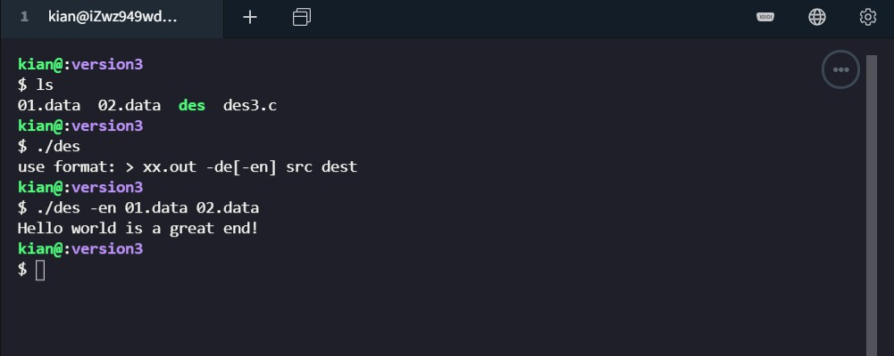
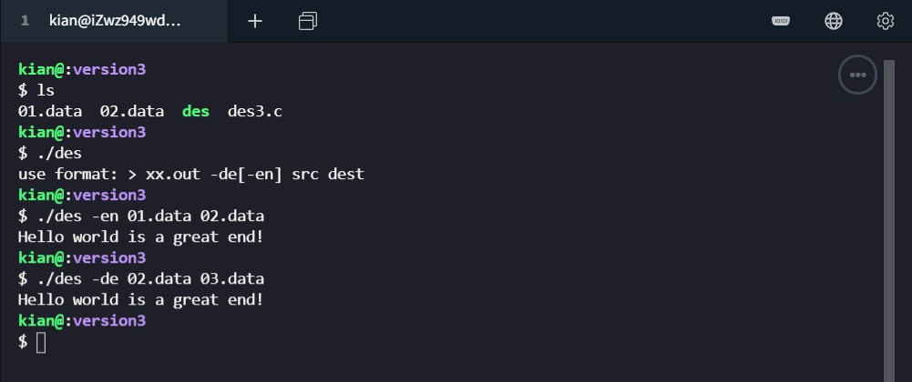

# DES 算法设计实现

#### 环境说明

操作系统：`Ubuntu 18.04.4 LTS (GNU/Linux 4.15.0-96-generic x86_64)`

编译 Kit：`gcc (Ubuntu 7.5.0-3ubuntu1~18.04) 7.5.0` 

## 算法原理概述

* DES 是一个基于56位密钥的对称算法  

* DES 是一种典型的块加密方法：它以64位为分组长度，明文被分割成64位一组作为算法的输入，经过一系列计算过程，输出同样64位长度的密文  

* DES 算法的基本过程是换位和置换  


## 总体结构

* 输入 64 位明文
* 初始置换 IP
    * 64 位明文进行 IP 置换后分成L0，R0两组
* 16 轮迭代 T
    * L[i] = R[i - 1], R[i] = L[i - 1] ^ f(R[i-1, K[i]] )
        * K[i]
            * 输入用户的 64 位密钥输出 16个 48位子密钥 K1-K16
            * 64 位密钥去除校验码变成 56 位密钥
            * 56 位密钥进行 PC - 1 置换
            * 将置换结果粉刺前 28 位 C[0] 和后 28位D[0]
            * C[i] = LSi(C[i - 1]), D[i] = LSi(D[i - 1])
                * LSi 函数
                    * 当 i = 1, 2, 9, 16 是，循环左移一位
                    * 否则，循环左移2位
            * 56 位的 C[i]D[i] 拼接后进行 PC - 2 置换，得到 48 位 K[i]
        * f(R[i-1], K[i])
            * 将 32 位的串 R[i - 1] 作 E-拓展，得到 48 位的串 E[R[i - 1]]
            * 将 E[R[i - 1]] 和 48 位的子密钥 Ki 作按位异或
            * 将异或结果(48位)平均分成8个小组。各组分别经过 8 个不同的 6to4 S-盒转换，将结果(32位)按顺序拼接
                * S-盒置换
                    * 行号 n = (b1b6)10
                    * 列号 m = (b2b3b4b5)10
                    * 在相应的si-box表中查询得出结果
            * 将拼接的32位结果进行 P-置换，输出32位数据
* 交换置换 W
    * L16R16 变成 R16L16
* 逆置换 IP-1
    * 通过逆置换规则重新排列
* 输出 64 位密文


## 模块分解

#### 置换函数

对于置换函数，输入是置换表 `table` 和 `char *` 类型源数据 `data` 

因为 c 语言传递参数不太方便，所以将置换后的结果 `ans` 也作为参数传入

函数首先确定置换后字符串的长度，然后对于 `ans` 的每一位，赋予对于的字符。

```c
void permutation(char *ans, char *data, int *table) {
    int len = strlen(ans);
    for (int i = 0; i < len; ++i) {
        ans[i] = data[table[i] - 1];
    }
    return ;
}
```

#### Feistel 结构

过程如下

* 获取 64 位初始数据 res
* 对 res 进行 IP 置换操作，得到 afterIPtable
* 将 afterIPtable 分解成 L[0] 和 R[0]
* 进行 16 轮迭代
    * L[i] = R[i - 1]
    * temp 保存 feistel 函数处理 R[i - 1] 和 subkeys[i] 后的返回值
    * R[i] 为 L[i - 1] 和 temp 按位异或的结果
* 将 R[16] 和 L[16] 拼接成新的afterIPtable
* 对 afterIPtable进行 IP - 1 置换操作，得到 des

```c
void data_encryption_standard(char *des, char *res, int isEncrypt) {
    char afterIPtable[65];
    memset(afterIPtable, '0', 64);
    afterIPtable[64] = '\0';
    permutation(afterIPtable, res, ip_table);

    char L[17][33];
    for (int i = 0; i <= 16; ++i) {
        memset(L[i], '0', 32);
        L[i][32] = '\0';
    }
    for (int i = 0; i < 32; ++i) {
        L[0][i] = afterIPtable[i];
    }

    char R[17][33];
    for (int i = 0; i <= 16; ++i) {
        memset(R[i], '0', 32);
        R[i][32] = '\0';
    }
    for (int i = 0; i < 32; ++i) {
        R[0][i] = afterIPtable[i + 32];
    }

    for (int i = 1; i <= 16; ++i) {
        strcpy(L[i], R[i - 1]);
        char temp[33];
        memset(temp, '0', 32);
        temp[32] = '\0';

        if (isEncrypt) {
            feistel(temp, R[i - 1], subkeys[i]);
        } else {
            feistel(temp, R[i - 1], subkeys[17 - i]);
        }

        for (int j = 0; j < 32; ++j) {
            if (temp[j] == L[i - 1][j]) {
                R[i][j] = '0';
            } else {
                R[i][j] = '1';
            }
        }
    }

    for (int i = 0; i < 32; ++i) {
        afterIPtable[i] = R[16][i];
        afterIPtable[i + 32] = L[16][i];
    }
    permutation(des, afterIPtable, ip_1_table);
    return ;
}
```


#### Feistel 轮函数 f(R[i-1], K[i]) 

过程如下

* 将 32 为的 r32 通过 E-拓展，得到 48 位的 e48
* 将 e48 和 k48 按位异或得到新的 e48
* 将新的 e48 平均分成 8 个小组，保存在 beforSbox 中
* 通过 S-盒转换函数 sboxFunc 处理 beforSbox 得到 afterSbox
* 将 afterSbox 拼接成 ans 输出

```c
void feistel(char *ans, char *r32, char *k48) {
    char e48[49];
    memset(e48, '0', 48);
    e48[48] = '\0';

    permutation(e48, r32, e_expand_table);

    for (int i = 0; i < 48; ++i) {
        if (e48[i] == k48[i]) {
            e48[i] = '0';
        } else {
            e48[i] = '1';
        }
    }

    char beforSbox[8][7];
    for (int i = 0; i < 8; ++i) {
        memset(beforSbox[i], '0', 6);
        beforSbox[i][6] = '\0';
    }
    for (int i = 0; i < 8; ++i) {
        for (int j = 0; j < 6; ++j) {
            beforSbox[i][j] = e48[i * 6 + j];
        }
    }

    char afterSbox[8][5];
    for (int i = 0; i < 8; ++i) {
        memset(afterSbox[i], '0', 4);
        afterSbox[i][4] = '\0';
    }
    for (int i = 0; i < 8; ++i) {
        sboxFunc(afterSbox[i], beforSbox[i], i);
    }

    for (int i = 0; i < 8; ++i) {
        for (int j = 0; j < 4; ++j) {
            ans[i * 8 + j] = afterSbox[i][j];
        }
    }
    return ;
}
```


#### S 盒 函数

该函数输入一个六位的01字符串，以及 S 盒 标号 i；输出一个 4 为的01字符串。

过程如下

* 计算 n
* 通过循环，计算得出 m
* 在 sbox 表中查询到 m，n 对应的数字 temp
* 将 temp 转换为二进制并保存到 after 中

```c
void sboxFunc(char *after, char *befor, int i) {
    int n = (befor[0] - '0') * 2 + befor[5] - '0';
    int m = 0;
    for (int i = 1; i <= 4; ++i) {
        m = m * 2 + befor[i] - '0';
    }
    int temp = sbox[i * 64 + n * 16 + m];
    for (int i = 4; i >= 1; --i) {
        after[i] = temp % 2 + '0';
        temp /= 2;
    }
    return ;
}
```


#### 生成子密钥

* 输入用户的 64 位密钥输出 16个 48位子密钥 K1-K16
* 64 位密钥去除校验码变成 56 位密钥
* 56 位密钥进行 PC - 1 置换
* 将置换结果分成前 28 位 C[0] 和后 28位D[0]
* C[i] = LSi(C[i - 1]), D[i] = LSi(D[i - 1])
    * LSi 函数
        * 当 i = 1, 2, 9, 16 是，循环左移一位
        * 否则，循环左移2位
* 56 位的 C[i]D[i] 拼接后进行 PC - 2 置换，得到 48 位 K[i]

```c
void initSubkeys(char *key) {
    char key56[57];
    memset(key56, ' ', 56);
    key56[56] = '\0';
    permutation(key56, key, pc1_table);

    char c[17][29];
    for (int i = 0; i <= 16; ++i) {
        memset(c[i], '0', 28);
        c[i][28] = '\0';
    }
    for (int i = 0; i < 28; ++i) {
        c[0][i] = key56[i];
    }

    char d[17][29];
    for (int i = 0; i <= 16; ++i) {
        memset(d[i], ' ', 28);
        d[i][28] = '\0';
    }
    for (int i = 0; i < 28; ++i) {
        d[0][i] = key56[i + 28];
    }

    for (int i = 1; i <= 16; ++i) {
        if (i == 1 || i == 2 || i == 9 || i == 16) {
            shift(c[i], c[i - 1], 1);
            shift(d[i], d[i - 1], 1);
        } else {
            shift(c[i], c[i - 1], 2);
            shift(d[i], d[i - 1], 2);
        }
    }

    char oldkeys[17][57];
    for (int i = 0; i <= 16; ++i) {
        for (int j = 0; j < 28; ++j) {
            oldkeys[i][j] = c[i][j];
            oldkeys[i][j + 28] = d[i][j];
        }
        oldkeys[i][56] = '\0';
    }

    for (int i = 0; i <= 16; ++i) {
        permutation(subkeys[i], oldkeys[i], pc2_table);
    }
}
```

#### 移位操作

该函数完成了 `循环左移` 操作，其中参数 n 表示循环左移的位数 

```c
void shift(char *ans, char *data, int n) {
    int len = strlen(ans);
    for (int i = 0; i < len; ++i) {
        ans[i] = data[(i + n) % len];
    }
    return ;
}
```


## 数据结构设计

#### 明文和密文

为了使过程可视化，明文和密文均采用只包含 `0`、`1` 的字符串

```c
char plaintext[65];
memset(plaintext, '0', 64);
plaintext[64] = '\0';

char ciphertext[65];
memset(ciphertext, '0', 64);
ciphertext[64] = '\0';
```

当数据在文件中存储时，采用 `fread` 函数每次取出 64 位数据

```c
int readbuf[65];
int writebuf[65];
memset(readbuf, '0', 64);
memset(writebuf, '0', 64);
readbuf[64] = '\0';
writebuf[64] = '\0';

while ((n = fread((void*)readbuf, 1, 64, pfr)) == 64) {
    data_encryption_standard(writebuf, readbuf, isEncrypt);
    fwrite((void*)writebuf, 1, 64, pfw);
}
```


#### 转换表

对于转换表和子密钥，采用了全局变量的形式。

转换表 采用 `int []` 类型，子密钥 采用 `char [][]` 类型

```
int pc1_table[56] = {
    27, 49, 41, 33, 25, 17,  9,
     1, 58, 50, 42, 34, 26, 18,
    10,  2, 59, 51, 43, 35, 27,
    19, 11,  3, 60, 52, 44, 36,
    63, 55, 47, 39, 31, 23, 15,
     7, 62, 54, 46, 38, 30, 22,
    14,  6, 61, 53, 45, 37, 29,
    21, 13,  5, 28, 20, 12,  4
};
int pc2_table[48] = {
    14, 17, 11, 24,  1,  5,
     3, 28, 15,  6, 21, 10,
    23, 19, 12,  4, 26,  8,
    16,  7, 27, 20, 13,  2,
    41, 52, 31, 37, 47, 55,
    30, 40, 51, 45, 33, 48,
    44, 49, 39, 56, 34, 53,
    46, 42, 50, 36, 29, 32
};
int ip_table[64] = {
    58, 50, 42, 34, 26, 18, 10, 2,
    60, 52, 44, 36, 28, 20, 12, 4,
    62, 54, 46, 38, 30, 22, 14, 6,
    64, 56, 48, 40, 32, 24, 16, 8,
    57, 49, 41, 33, 25, 17,  9, 1,
    59, 51, 43, 35, 27, 19, 11, 3,
    61, 53, 45, 37, 29, 21, 13, 5,
    63, 55, 47, 39, 31, 23, 15, 7
};
int ip_1_table[64] = {
    40, 8, 48, 16, 56, 24, 64, 32,
    39, 7, 47, 15, 55, 23, 63, 31,
    38, 6, 46, 14, 54, 22, 62, 30,
    37, 5, 45, 13, 53, 21, 61, 29,
    36, 4, 44, 12, 52, 20, 60, 28,
    35, 3, 43, 11, 51, 19, 59, 27,
    34, 2, 42, 10, 50, 18, 58, 26,
    33, 1, 41,  9, 49, 17, 57, 25
};
int e_expand_table[48] = {
    32,  1,  2,  3,  4,  5,
     4,  5,  6,  7,  8,  9,
     8,  9, 10, 11, 12, 13,
    12, 13, 14, 15, 16, 17,
    16, 17, 18, 19, 20, 21,
    20, 21, 22, 23, 24, 25,
    24, 25, 26, 27, 28, 29,
    28, 29, 30, 31, 32, 1
};
int sbox[8 * 4 * 16] = {
    14, 4 , 13, 1 , 2 , 15, 11, 8 , 3 , 10, 6 , 12, 5 , 9 , 0 , 7 ,
    0 , 15, 7 , 4 , 14, 2 , 13, 1 , 10, 6 , 12, 11, 9 , 5 , 3 , 8 ,
    4 , 1 , 14, 8 , 13, 6 , 2 , 11, 15, 12, 9 , 7 , 3 , 10, 5 , 0 ,
    15, 12, 8 , 2 , 4 , 9 , 1 , 7 , 5 , 11, 3 , 14, 10, 0 , 6 , 13,

    15, 1 , 8 , 14, 6 , 11, 3 , 4 , 9 , 7 , 2 , 13, 12, 0 , 5 , 10,
    3 , 13, 4 , 7 , 15, 2 , 8 , 14, 12, 0 , 1 , 10, 6 , 9 , 11, 5 ,
    0 , 14, 7 , 11, 10, 4 , 13, 1 , 5 , 8 , 12, 6 , 9 , 3 , 2 , 15,
    13, 8 , 10, 1 , 3 , 15, 4 , 2 , 11, 6 , 7 , 12, 0 , 5 , 14, 9 ,

    10, 0 , 9 , 14, 6 , 3 , 15, 5 , 1 , 13, 12, 7 , 11, 4 , 2 , 8 ,
    13, 7 , 0 , 9 , 3 , 4 , 6 , 10, 2 , 8 , 5 , 14, 12, 11, 15, 1 ,
    13, 6 , 4 , 9 , 8 , 15, 3 , 0 , 11, 1 , 2 , 12, 5 , 10, 14, 7 ,
    1 , 10, 13, 0 , 6 , 9 , 8 , 7 , 4 , 15, 14, 3 , 11, 5 , 2 , 12,

    7 , 13, 14, 3 , 0 , 6 , 9 , 10, 1 , 2 , 8 , 5 , 11, 12, 4 , 15,
    13, 8 , 11, 5 , 6 , 15, 0 , 3 , 4 , 7 , 2 , 12, 1 , 10, 14, 9 ,
    10, 6 , 9 , 0 , 12, 11, 7 , 13, 15, 1 , 3 , 14, 5 , 2 , 8 , 4 ,
    3 , 15, 0 , 6 , 10, 1 , 13, 8 , 9 , 4 , 5 , 11, 12, 7 , 2 , 14,

    2 , 12, 4 , 1 , 7 , 10, 11, 6 , 8 , 5 , 3 , 15, 13, 0 , 14, 9 ,
    14, 11, 2 , 12, 4 , 7 , 13, 1 , 5 , 0 , 15, 10, 3 , 9 , 8 , 6 ,
    4 , 2 , 1 , 11, 10, 13, 7 , 8 , 15, 9 , 12, 5 , 6 , 3 , 0 , 14,
    11, 8 , 12, 7 , 1 , 14, 2 , 13, 6 , 15, 0 , 9 , 10, 4 , 5 , 3 ,

    12, 1 , 10, 15, 9 , 2 , 6 , 8 , 0 , 13, 3 , 4 , 14, 7 , 5 , 11,
    10, 15, 4 , 2 , 7 , 12, 9 , 5 , 6 , 1 , 13, 14, 0 , 11, 3 , 8 ,
    9 , 14, 15, 5 , 2 , 8 , 12, 3 , 7 , 0 , 4 , 10, 1 , 13, 11, 6 ,
    4 , 3 , 2 , 12, 9 , 5 , 15, 10, 11, 14, 1 , 7 , 6 , 0 , 8 , 13,

    4 , 11, 2 , 14, 15, 0 , 8 , 13, 3 , 12, 9 , 7 , 5 , 10, 6 , 1 ,
    13, 0 , 11, 7 , 4 , 9 , 1 , 10, 14, 3 , 5 , 12, 2 , 15, 8 , 6 ,
    1 , 4 , 11, 13, 12, 3 , 7 , 14, 10, 15, 6 , 8 , 0 , 5 , 9 , 2 ,
    6 , 11, 13, 8 , 1 , 4 , 10, 7 , 9 , 5 , 0 , 15, 14, 2 , 3 , 12,

    13, 2 , 8 , 4 , 6 , 15, 11, 1 , 10, 9 , 3 , 14, 5 , 0 , 12, 7 ,
    1 , 15, 13, 8 , 10, 3 , 7 , 4 , 12, 5 , 6 , 11, 0 , 14, 9 , 2 ,
    7 , 11, 4 , 1 , 9 , 12, 14, 2 , 0 , 6 , 10, 13, 15, 3 , 5 , 8 ,
    2 , 1 , 14, 7 , 4 , 10, 8 , 13, 15, 12, 9 , 0 , 3 , 5 , 6 , 11
};
char subkeys[17][49];
```


## C 语言源代码

```c
#include <stdio.h>
#include <string.h>  // strlen
#include <stdlib.h>  // malloc

int pc1_table[56] = {
    27, 49, 41, 33, 25, 17,  9,
     1, 58, 50, 42, 34, 26, 18,
    10,  2, 59, 51, 43, 35, 27,
    19, 11,  3, 60, 52, 44, 36,
    63, 55, 47, 39, 31, 23, 15,
     7, 62, 54, 46, 38, 30, 22,
    14,  6, 61, 53, 45, 37, 29,
    21, 13,  5, 28, 20, 12,  4
};
int pc2_table[48] = {
    14, 17, 11, 24,  1,  5,
     3, 28, 15,  6, 21, 10,
    23, 19, 12,  4, 26,  8,
    16,  7, 27, 20, 13,  2,
    41, 52, 31, 37, 47, 55,
    30, 40, 51, 45, 33, 48,
    44, 49, 39, 56, 34, 53,
    46, 42, 50, 36, 29, 32
};
int ip_table[64] = {
    58, 50, 42, 34, 26, 18, 10, 2,
    60, 52, 44, 36, 28, 20, 12, 4,
    62, 54, 46, 38, 30, 22, 14, 6,
    64, 56, 48, 40, 32, 24, 16, 8,
    57, 49, 41, 33, 25, 17,  9, 1,
    59, 51, 43, 35, 27, 19, 11, 3,
    61, 53, 45, 37, 29, 21, 13, 5,
    63, 55, 47, 39, 31, 23, 15, 7
};
int ip_1_table[64] = {
    40, 8, 48, 16, 56, 24, 64, 32,
    39, 7, 47, 15, 55, 23, 63, 31,
    38, 6, 46, 14, 54, 22, 62, 30,
    37, 5, 45, 13, 53, 21, 61, 29,
    36, 4, 44, 12, 52, 20, 60, 28,
    35, 3, 43, 11, 51, 19, 59, 27,
    34, 2, 42, 10, 50, 18, 58, 26,
    33, 1, 41,  9, 49, 17, 57, 25
};
int e_expand_table[48] = {
    32,  1,  2,  3,  4,  5,
     4,  5,  6,  7,  8,  9,
     8,  9, 10, 11, 12, 13,
    12, 13, 14, 15, 16, 17,
    16, 17, 18, 19, 20, 21,
    20, 21, 22, 23, 24, 25,
    24, 25, 26, 27, 28, 29,
    28, 29, 30, 31, 32, 1
};
int sbox[8 * 4 * 16] = {
    14, 4 , 13, 1 , 2 , 15, 11, 8 , 3 , 10, 6 , 12, 5 , 9 , 0 , 7 ,
    0 , 15, 7 , 4 , 14, 2 , 13, 1 , 10, 6 , 12, 11, 9 , 5 , 3 , 8 ,
    4 , 1 , 14, 8 , 13, 6 , 2 , 11, 15, 12, 9 , 7 , 3 , 10, 5 , 0 ,
    15, 12, 8 , 2 , 4 , 9 , 1 , 7 , 5 , 11, 3 , 14, 10, 0 , 6 , 13,

    15, 1 , 8 , 14, 6 , 11, 3 , 4 , 9 , 7 , 2 , 13, 12, 0 , 5 , 10,
    3 , 13, 4 , 7 , 15, 2 , 8 , 14, 12, 0 , 1 , 10, 6 , 9 , 11, 5 ,
    0 , 14, 7 , 11, 10, 4 , 13, 1 , 5 , 8 , 12, 6 , 9 , 3 , 2 , 15,
    13, 8 , 10, 1 , 3 , 15, 4 , 2 , 11, 6 , 7 , 12, 0 , 5 , 14, 9 ,

    10, 0 , 9 , 14, 6 , 3 , 15, 5 , 1 , 13, 12, 7 , 11, 4 , 2 , 8 ,
    13, 7 , 0 , 9 , 3 , 4 , 6 , 10, 2 , 8 , 5 , 14, 12, 11, 15, 1 ,
    13, 6 , 4 , 9 , 8 , 15, 3 , 0 , 11, 1 , 2 , 12, 5 , 10, 14, 7 ,
    1 , 10, 13, 0 , 6 , 9 , 8 , 7 , 4 , 15, 14, 3 , 11, 5 , 2 , 12,

    7 , 13, 14, 3 , 0 , 6 , 9 , 10, 1 , 2 , 8 , 5 , 11, 12, 4 , 15,
    13, 8 , 11, 5 , 6 , 15, 0 , 3 , 4 , 7 , 2 , 12, 1 , 10, 14, 9 ,
    10, 6 , 9 , 0 , 12, 11, 7 , 13, 15, 1 , 3 , 14, 5 , 2 , 8 , 4 ,
    3 , 15, 0 , 6 , 10, 1 , 13, 8 , 9 , 4 , 5 , 11, 12, 7 , 2 , 14,

    2 , 12, 4 , 1 , 7 , 10, 11, 6 , 8 , 5 , 3 , 15, 13, 0 , 14, 9 ,
    14, 11, 2 , 12, 4 , 7 , 13, 1 , 5 , 0 , 15, 10, 3 , 9 , 8 , 6 ,
    4 , 2 , 1 , 11, 10, 13, 7 , 8 , 15, 9 , 12, 5 , 6 , 3 , 0 , 14,
    11, 8 , 12, 7 , 1 , 14, 2 , 13, 6 , 15, 0 , 9 , 10, 4 , 5 , 3 ,

    12, 1 , 10, 15, 9 , 2 , 6 , 8 , 0 , 13, 3 , 4 , 14, 7 , 5 , 11,
    10, 15, 4 , 2 , 7 , 12, 9 , 5 , 6 , 1 , 13, 14, 0 , 11, 3 , 8 ,
    9 , 14, 15, 5 , 2 , 8 , 12, 3 , 7 , 0 , 4 , 10, 1 , 13, 11, 6 ,
    4 , 3 , 2 , 12, 9 , 5 , 15, 10, 11, 14, 1 , 7 , 6 , 0 , 8 , 13,

    4 , 11, 2 , 14, 15, 0 , 8 , 13, 3 , 12, 9 , 7 , 5 , 10, 6 , 1 ,
    13, 0 , 11, 7 , 4 , 9 , 1 , 10, 14, 3 , 5 , 12, 2 , 15, 8 , 6 ,
    1 , 4 , 11, 13, 12, 3 , 7 , 14, 10, 15, 6 , 8 , 0 , 5 , 9 , 2 ,
    6 , 11, 13, 8 , 1 , 4 , 10, 7 , 9 , 5 , 0 , 15, 14, 2 , 3 , 12,

    13, 2 , 8 , 4 , 6 , 15, 11, 1 , 10, 9 , 3 , 14, 5 , 0 , 12, 7 ,
    1 , 15, 13, 8 , 10, 3 , 7 , 4 , 12, 5 , 6 , 11, 0 , 14, 9 , 2 ,
    7 , 11, 4 , 1 , 9 , 12, 14, 2 , 0 , 6 , 10, 13, 15, 3 , 5 , 8 ,
    2 , 1 , 14, 7 , 4 , 10, 8 , 13, 15, 12, 9 , 0 , 3 , 5 , 6 , 11
};
char subkeys[17][49];

void permutation(char *ans, char *data, int *table);
void feistel(char *ans, char *r32, char *k48);
void sboxFunc(char *after, char *befor, int i);
void initSubkeys(char *key);
void shift(char *ans, char *data, int n);

void data_encryption_standard(char *des, char *res, int isEncrypt) {
    char afterIPtable[65];
    memset(afterIPtable, '0', 64);
    afterIPtable[64] = '\0';
    permutation(afterIPtable, res, ip_table);

    char L[17][33];
    for (int i = 0; i <= 16; ++i) {
        memset(L[i], '0', 32);
        L[i][32] = '\0';
    }
    for (int i = 0; i < 32; ++i) {
        L[0][i] = afterIPtable[i];
    }

    char R[17][33];
    for (int i = 0; i <= 16; ++i) {
        memset(R[i], '0', 32);
        R[i][32] = '\0';
    }
    for (int i = 0; i < 32; ++i) {
        R[0][i] = afterIPtable[i + 32];
    }

    for (int i = 1; i <= 16; ++i) {
        strcpy(L[i], R[i - 1]);
        char temp[33];
        memset(temp, '0', 32);
        temp[32] = '\0';

        if (isEncrypt) {
            feistel(temp, R[i - 1], subkeys[i]);
        } else {
            feistel(temp, R[i - 1], subkeys[17 - i]);
        }

        for (int j = 0; j < 32; ++j) {
            if (temp[j] == L[i - 1][j]) {
                R[i][j] = '0';
            } else {
                R[i][j] = '1';
            }
        }
    }

    for (int i = 0; i < 32; ++i) {
        afterIPtable[i] = R[16][i];
        afterIPtable[i + 32] = L[16][i];
    }
    permutation(des, afterIPtable, ip_1_table);
    return ;
}

int main(int argc, char * argv[]) {
    if(argc != 4) {
        printf("use format: > xx.out -de[-en] src dest\n");
        exit(-1);
    }

    FILE * pfr = fopen(argv[2], "rb+");
    if(NULL == pfr)
        exit(-1);

    FILE * pfw = fopen(argv[3], "wb+");
    if(NULL == pfw) {
        fclose(pfr);
        exit(-1);
    }

    int n = 0;
    int readbuf[65];
    int writebuf[65];
    memset(readbuf, '0', 64);
    memset(writebuf, '0', 64);
    readbuf[64] = '\0';
    writebuf[64] = '\0';

    char key[65] = "0000000100000010000000110000010000000101000001100000011100001000\0";
    for (int i = 0; i <= 16; ++i) {
        memset(subkeys[i], '0', 48);
        subkeys[i][48] = '\0';
    }
    initSubkeys(key);

    int isEncrypt = 0;
    if (strcmp(argv[1], "-en") == 0 || strcmp(argv[1], "-de") == 0) {
        if (strcmp(argv[1], "-en") == 0) {
            isEncrypt = 1;
        }
        while ((n = fread((void*)readbuf, 1, 64, pfr)) == 64) {
            data_encryption_standard(writebuf, readbuf, isEncrypt);
            fwrite((void*)writebuf, 1, 64, pfw);
        }
        if (n > 0) {
            int nByte = (64 - n) / 8;
            char temp[8];
            memset(temp, '0', 8);
            for (int i = 0, t = nByte; t; t /= 2 ) {
                temp[7 - i] = t % 2 + '0';
            }
            for (int i = 0; i < nByte; ++i) {
                for (int j = 0; j < 8; ++j) {
                    readbuf[n + i * 8 + j] = temp[j];
                }
            }
        } else {
            char *temp = "0000100000001000000010000000100000001000000010000000100000001000";

            strcpy(writebuf, temp);
        }
        data_encryption_standard(writebuf, readbuf, isEncrypt);
        fwrite((void*)writebuf, 1, 64, pfw);
    } else {
        printf("arg error!\n");
    }

    fclose(pfw);
    fclose(pfr);
    printf("Hello world is a great end!\n");
    return 0;
}

void permutation(char *ans, char *data, int *table) {
    int len = strlen(ans);
    for (int i = 0; i < len; ++i) {
        ans[i] = data[table[i] - 1];
    }
    return ;
}

void feistel(char *ans, char *r32, char *k48) {
    char e48[49];
    memset(e48, '0', 48);
    e48[48] = '\0';

    permutation(e48, r32, e_expand_table);

    for (int i = 0; i < 48; ++i) {
        if (e48[i] == k48[i]) {
            e48[i] = '0';
        } else {
            e48[i] = '1';
        }
    }

    char beforSbox[8][7];
    for (int i = 0; i < 8; ++i) {
        memset(beforSbox[i], '0', 6);
        beforSbox[i][6] = '\0';
    }
    for (int i = 0; i < 8; ++i) {
        for (int j = 0; j < 6; ++j) {
            beforSbox[i][j] = e48[i * 6 + j];
        }
    }

    char afterSbox[8][5];
    for (int i = 0; i < 8; ++i) {
        memset(afterSbox[i], '0', 4);
        afterSbox[i][4] = '\0';
    }
    for (int i = 0; i < 8; ++i) {
        sboxFunc(afterSbox[i], beforSbox[i], i);
    }

    for (int i = 0; i < 8; ++i) {
        for (int j = 0; j < 4; ++j) {
            ans[i * 8 + j] = afterSbox[i][j];
        }
    }
    return ;
}

void sboxFunc(char *after, char *befor, int i) {
    int n = (befor[0] - '0') * 2 + befor[5] - '0';
    int m = 0;
    for (int i = 1; i <= 4; ++i) {
        m = m * 2 + befor[i] - '0';
    }
    int temp = sbox[i * 64 + n * 16 + m];
    for (int i = 4; i >= 1; --i) {
        after[i] = temp % 2 + '0';
        temp /= 2;
    }
    return ;
}

void initSubkeys(char *key) {
    char key56[57];
    memset(key56, ' ', 56);
    key56[56] = '\0';
    permutation(key56, key, pc1_table);

    char c[17][29];
    for (int i = 0; i <= 16; ++i) {
        memset(c[i], '0', 28);
        c[i][28] = '\0';
    }
    for (int i = 0; i < 28; ++i) {
        c[0][i] = key56[i];
    }

    char d[17][29];
    for (int i = 0; i <= 16; ++i) {
        memset(d[i], ' ', 28);
        d[i][28] = '\0';
    }
    for (int i = 0; i < 28; ++i) {
        d[0][i] = key56[i + 28];
    }

    for (int i = 1; i <= 16; ++i) {
        if (i == 1 || i == 2 || i == 9 || i == 16) {
            shift(c[i], c[i - 1], 1);
            shift(d[i], d[i - 1], 1);
        } else {
            shift(c[i], c[i - 1], 2);
            shift(d[i], d[i - 1], 2);
        }
    }

    char oldkeys[17][57];
    for (int i = 0; i <= 16; ++i) {
        for (int j = 0; j < 28; ++j) {
            oldkeys[i][j] = c[i][j];
            oldkeys[i][j + 28] = d[i][j];
        }
        oldkeys[i][56] = '\0';
    }

    for (int i = 0; i <= 16; ++i) {
        permutation(subkeys[i], oldkeys[i], pc2_table);
    }
}

void shift(char *ans, char *data, int n) {
    int len = strlen(ans);
    for (int i = 0; i < len; ++i) {
        ans[i] = data[(i + n) % len];
    }
    return ;
}
```


## 编译运行结果

> 注：将某文件先加密再解密后，数据会变长，增加的部分是之前补的后缀，后缀前的数据是完全匹配的。

加密



解密



